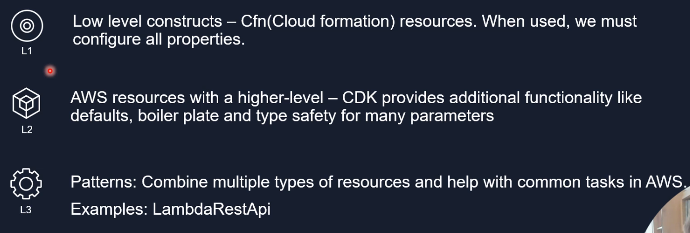
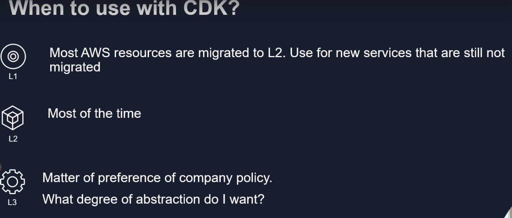
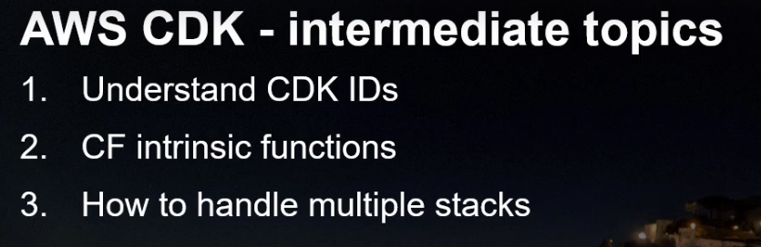
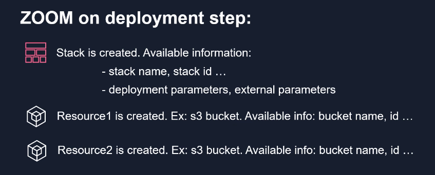
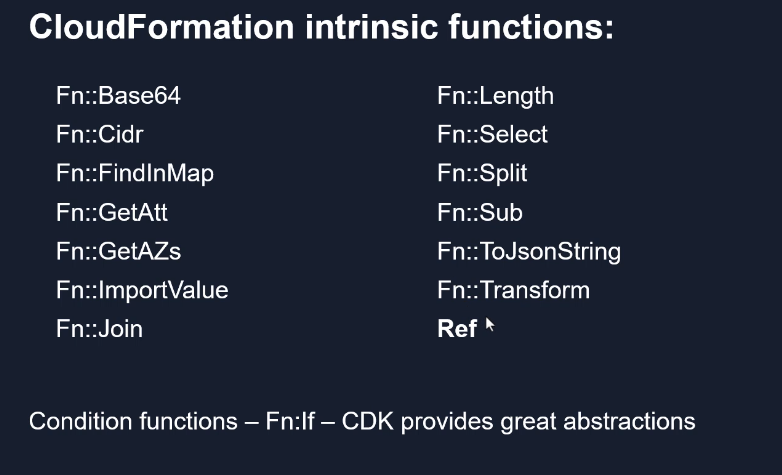
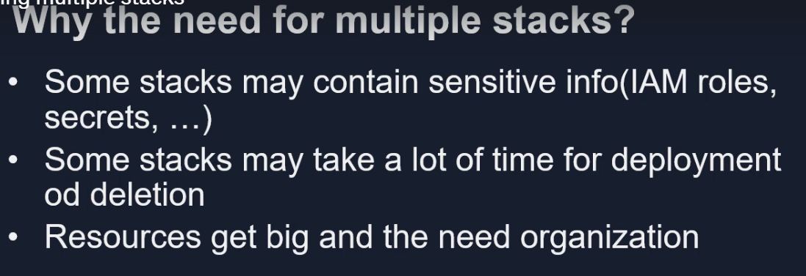
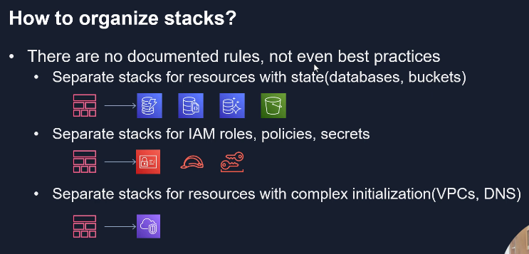
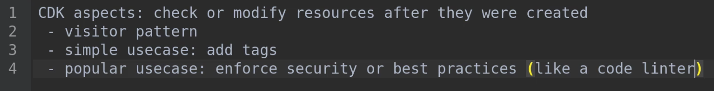
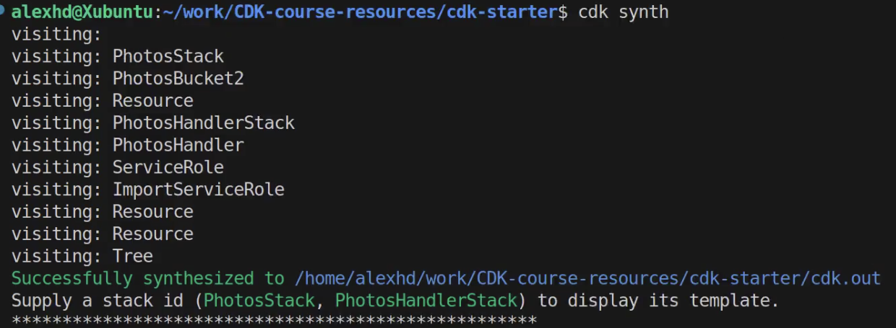

# AWS-CDK-TS-React

https://github.com/alexhddev

- create user for command line interface - AWS CLI - from `AWS IAM` - GO to IAM > users -> create user -> name: cli-access -> attach Administrator Access Policy to be able to deploy resources -> create - Now let's Install AWS CLI - it's already installed -
  ```
    C:\Users\abhis>aws --version
    aws-cli/2.18.1 Python/3.12.6 Windows/11 exe/AMD64
  ```
- the configure aws cli
  ```
  C:\Users\abhis>aws configure
  AWS Access Key ID [****************Abhi]: PROVIDE_ACCESS_KEY_FROM_USER_SECURITY_CREDENTIALS
  AWS Secret Access Key [****************Abhi]: PROVIDE_SECRET_KEY_FROM_USER_SECURITY_CREDENTIALS
  Default region name [us-east-1]: ap-south-1
  Default output format [json]: json
  ```
  - To test it's working do `aws s3 ls` - shouldn't return any error and returns empty as we don't have anything in aws account to list s3 bucket info

# Basics of cloudForamtion and CDK

```
$ npm i -g aws-cdk

added 1 package in 3s
npm notice
npm notice New minor version of npm available! 10.8.2 -> 10.9.0
npm notice Changelog: https://github.com/npm/cli/releases/tag/v10.9.0
npm notice To update run: npm install -g npm@10.9.0
npm notice

abhis@Tinku MINGW64 ~/Desktop/AWS/AWS-CDK-TS-React (main)
$ cdk --version
2.162.1 (build 10aa526)

abhis@Tinku MINGW64 ~/Desktop/AWS/AWS-CDK-TS-React (main)
$ mkdir cdk-starter

abhis@Tinku MINGW64 ~/Desktop/AWS/AWS-CDK-TS-React (main)
$ cd cdk-starter/

abhis@Tinku MINGW64 ~/Desktop/AWS/AWS-CDK-TS-React/cdk-starter (main)
$ cdk init
Available templates:
* app: Template for a CDK Application
   └─ cdk init app --language=[csharp|fsharp|go|java|javascript|python|typescript]
* lib: Template for a CDK Construct Library
   └─ cdk init lib --language=typescript
* sample-app: Example CDK Application with some constructs
   └─ cdk init sample-app --language=[csharp|fsharp|go|java|javascript|python|typescript]

abhis@Tinku MINGW64 ~/Desktop/AWS/AWS-CDK-TS-React/cdk-starter (main)
$ cdk init --language=typescript
Applying project template app for typescript
# Welcome to your CDK TypeScript project

This is a blank project for CDK development with TypeScript.

The `cdk.json` file tells the CDK Toolkit how to execute your app.

## Useful commands

* `npm run build`   compile typescript to js
* `npm run watch`   watch for changes and compile
* `npm run test`    perform the jest unit tests
* `npx cdk deploy`  deploy this stack to your default AWS account/region
* `npx cdk diff`    compare deployed stack with current state
* `npx cdk synth`   emits the synthesized CloudFormation template

Executing npm install...
✅ All done
```

-> bin folder contains the code to initialize our application
-> lib folder contains actual cloud formation stacks
-> In package.json -> "constructs": "^10.0.0", - required for us the types and functionality that will generate CF templates , "ts-node": "^10.9.2", - helps us to execute typescript code
-> cdk.json -> configues the cdk inside this project -> app is the entry point into our project

- "app": "npx ts-node --prefer-ts-exts bin/cdk-starter.ts" -> execute ts-node library executes typescript code & path to bin folder and our starter file
  https://docs.aws.amazon.com/cdk/api/v2/docs/aws-construct-library.html - whole documentation of aws cdk construct - https://github.com/aws/aws-cdk

- deploy basic stack to AWS

```
abhis@Tinku MINGW64 ~/Desktop/AWS/AWS-CDK-TS-React/cdk-starter (main)
$ aws s3 ls
2024-10-21 03:00:33 cf-templates-**********-ap-south-1
2024-10-21 03:00:05 cf-templates-**********-us-west-2

abhis@Tinku MINGW64 ~/Desktop/AWS/AWS-CDK-TS-React/cdk-starter (main)
$ cdk bootstrap
 ⏳  Bootstrapping environment aws://AWS_ACCOUNT/ap-south-1...
Trusted accounts for deployment: (none)
Trusted accounts for lookup: (none)
Using default execution policy of 'arn:aws:iam::aws:policy/AdministratorAccess'. Pass '--cloudformation-execution-policies' to customize.
CDKToolkit: creating CloudFormation changeset...
CDKToolkit |  0/12 | 3:35:06 AM | REVIEW_IN_PROGRESS   | AWS::CloudFormation::Stack | CDKToolkit User Initiated
CDKToolkit |  0/12 | 3:35:12 AM | CREATE_IN_PROGRESS   | AWS::CloudFormation::Stack | CDKToolkit User Initiated
....
CDKToolkit |  0/12 | 3:35:14 AM | CREATE_IN_PROGRESS   | AWS::S3::Bucket         | StagingBucket
....
CDKToolkit |  1/12 | 3:35:16 AM | CREATE_IN_PROGRESS   | AWS::S3::Bucket         | StagingBucket Resource creation Initiated
CDKToolkit |  2/12 | 3:35:16 AM | CREATE_COMPLETE      | AWS::ECR::Repository    | ContainerAssetsRepository
CDKToolkit |  2/12 | 3:35:16 AM | CREATE_IN_PROGRESS   | AWS::IAM::Role          | LookupRole Resource creation Initiated
CDKToolkit |  3/12 | 3:35:31 AM | CREATE_COMPLETE      | AWS::S3::Bucket         | StagingBucket
CDKToolkit |  3/12 | 3:35:32 AM | CREATE_IN_PROGRESS   | AWS::S3::BucketPolicy   | StagingBucketPolicy
.....
CDKToolkit | 12/12 | 3:35:55 AM | CREATE_COMPLETE      | AWS::CloudFormation::Stack | CDKToolkit
 ✅  Environment aws://AWS_ACCOUNT/ap-south-1 bootstrapped.
```

- In Our CF , we have new stack - CDKToolKit stack - This stack includes resources needed to deploy AWS CDK apps into this environment
- Inside Stack Resources - have an s3 bucket - StagingBucket - this bucket will contain files required by AWS CDK in order to deploy

```
abhis@Tinku MINGW64 ~/Desktop/AWS/AWS-CDK-TS-React/cdk-starter (main)
$ cdk deploy
✨  Synthesis time: 5.99s
CdkStarterStack: start: Building ****:current_account-current_region
CdkStarterStack: success: Built *****:current_account-current_region
CdkStarterStack: start: Publishing *****:current_account-current_region
CdkStarterStack: success: Published *****:current_account-current_region
Stack undefined
CdkStarterStack: deploying... [1/1]
CdkStarterStack: creating CloudFormation changeset...
CdkStarterStack | 0/2 | 3:41:39 AM | REVIEW_IN_PROGRESS   | AWS::CloudFormation::Stack | CdkStarterStack User Initiated
CdkStarterStack | 0/2 | 3:41:45 AM | CREATE_IN_PROGRESS   | AWS::CloudFormation::Stack | CdkStarterStack User Initiated
CdkStarterStack | 0/2 | 3:41:47 AM | CREATE_IN_PROGRESS   | AWS::CDK::Metadata | CDKMetadata/Default (CDKMetadata)
CdkStarterStack | 0/2 | 3:41:47 AM | CREATE_IN_PROGRESS   | AWS::CDK::Metadata | CDKMetadata/Default (CDKMetadata) Resource creation Initiated
CdkStarterStack | 1/2 | 3:41:48 AM | CREATE_COMPLETE      | AWS::CDK::Metadata | CDKMetadata/Default (CDKMetadata)
CdkStarterStack | 2/2 | 3:41:48 AM | CREATE_COMPLETE      | AWS::CloudFormation::Stack | CdkStarterStack
 ✅  CdkStarterStack
✨  Deployment time: 12.15s
Stack ARN:
arn:aws:cloudformation:ap-south-1:AWS_ACCOUNT:stack/CdkStarterStack/**********
✨  Total time: 18.14s
```

- what cdk deploy did? - we have cdk.out file - contains the CF template that is actually deployed to AWS - everytime - does two things - generates templates & deploys
  cdk synth - will take our code and only generate a template

# Important concept of CDK is CDK constructs & there are multiple types of constructs

Building blocks of our CDK application



-> Also lets see how we can use CDK constructs to create diff aws resources

# CDK Commands

- `cdk init app --language typescript` - specify app to initialize the project
- `cdk bootsrap` - before deploying project - we call bootstrap in order to make a started environment for all our applications
- `cdk synth` - takes our code & generate template for each stacks
- `cdk deploy` - deploy them too aws & we can specify name of the stack when deploying a specific stack
- `cdk list` - lists the stacks we created
- `cdk diff` - display what we have locally and what we have remotely deployed in our CF env

```
Stack CdkStarterStack
Resources
[~] AWS::S3::Bucket MyL2Bucket MyL2BucketC842E3F4
 └─ [~] LifecycleConfiguration
     └─ [~] .Rules:
         └─ @@ -1,6 +1,6 @@
            [ ] [
            [ ]   {
            [-]     "ExpirationInDays": 2,
            [+]     "ExpirationInDays": 4,
            [ ]     "Status": "Enabled"
            [ ]   }
            [ ] ]
✨  Number of stacks with differences: 1
```

- `cdk doctor`

```
 cdk doctor
ℹ️ CDK Version: 2.162.1 (build 10aa526)
ℹ️ AWS environment variables:
  - AWS_NODEJS_CONNECTION_REUSE_ENABLED = 1
  - AWS_SDK_LOAD_CONFIG = 1
  - AWS_STS_REGIONAL_ENDPOINTS = regional
ℹ️ No CDK environment variables
```

- `cdk destroy` - deletes our stack

# Cloud Formation outputs

```
cdk synth
bucket name ${Token[TOKEN.31]}
```

if we want information only CF has we can call CF outputs `CfnOutput`

```
cdk deploy

CdkStarterStack: deploying... [1/1]
CdkStarterStack: creating CloudFormation changeset...
CdkStarterStack | 0/4 | 4:33:18 AM | UPDATE_IN_PROGRESS   | AWS::CloudFormation::Stack | CdkStarterStack User Initiated
CdkStarterStack | 0/4 | 4:33:21 AM | UPDATE_IN_PROGRESS   | AWS::CDK::Metadata | CDKMetadata/Default (CDKMetadata)
CdkStarterStack | 0/4 | 4:33:22 AM | UPDATE_IN_PROGRESS   | AWS::S3::Bucket    | MyL2Bucket (MyL2Bucket***)
CdkStarterStack | 1/4 | 4:33:22 AM | UPDATE_COMPLETE      | AWS::CDK::Metadata | CDKMetadata/Default (CDKMetadata)
CdkStarterStack | 2/4 | 4:33:43 AM | UPDATE_COMPLETE      | AWS::S3::Bucket    | MyL2Bucket (MyL2Bucket***)
CdkStarterStack | 3/4 | 4:33:44 AM | UPDATE_COMPLETE_CLEA | AWS::CloudFormation::Stack | CdkStarterStack
CdkStarterStack | 4/4 | 4:33:45 AM | UPDATE_COMPLETE      | AWS::CloudFormation::Stack | CdkStarterStack
 ✅  CdkStarterStack
Outputs:
CdkStarterStack.MyL2BucketName = cdkstarterstack-myl2bucket**********
```

# CDK Deployment parameters

- How we can provide data to our deployment using CF construct called CF parameters
- Sometimes when we deploy a stack , we want to specify some parameters before deploying it \* log level of application
  `cdk deploy --parameters duration = 9`

```
 cdk destroy CdkStarterStack
Are you sure you want to delete: CdkStarterStack (y/n)? y
CdkStarterStack: destroying... [1/1]

 ✅  CdkStarterStack: destroyed
```

Eveen after we deleted our stack we can still see L2 and L3 buckets in S3 , because by default CDK creates a s3 bucket with a different retention policy. let's check [documentation](https://docs.aws.amazon.com/cdk/api/v2/docs/aws-cdk-lib.aws_s3.Bucket.html) for this - removePolicy - by default - it doesn't delete resources created from cdk constructs for aws resources

# CDK intermediate topics



### CDk IDs

when we create a construct of Bucket - we get a logicalID(required by CF to use this ID) and Physical ID(required by AWS) when we deploy the stack

### CF instrinsic functions

Built-in functions to help manage our stacks

If we want to choose one resource first to be created before another resource. This is important because one resource needs information from another resource. Here is the point where cloud formation instrinsic funtions come into place.

The most popular used one is `ref` function - helps us reference different information around CF template

### Handling multiple stacks


[CF best practices](https://docs.aws.amazon.com/AWSCloudFormation/latest/UserGuide/best-practices.html)


### Cross stack references

Let's see how we can access values through references btw two stacks

- First deploy - `cdk deploy PhotosStack`
- Then deploy - `ck deploy PhotosHandlerStack` to access photos-bucket arn from above stack
- but this is not a best practice

### Sharing resources with CDK

`cdk deploy --all` deploys the stacks in order we need as it is able to understand the dependency exists on photosstack to create photoshandlerstack

### ASpects

