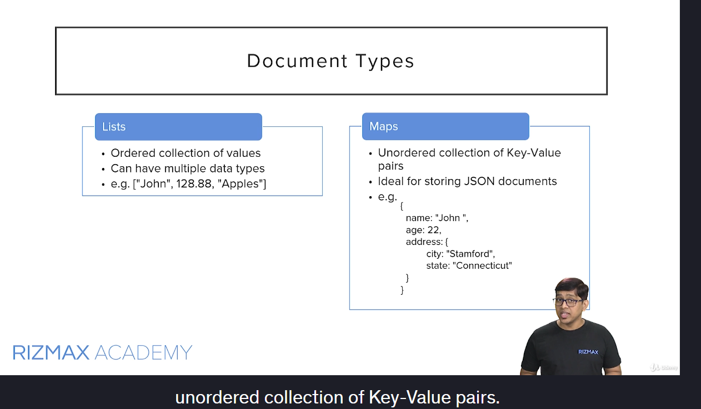

# Lambda

- will be using node.js and [devGuide](https://docs.aws.amazon.com/lambda/latest/dg/nodejs-handler.html)
- npm init - will gives us package.json to install libraries we need
- npm install moment --save

## API Gateway

- refer local written notes

- https://developer.mozilla.org/en-US/docs/Web/HTTP/Headers/Access-Control-Allow-Origin

- [request mapping template](https://docs.aws.amazon.com/apigateway/latest/developerguide/api-gateway-mapping-template-reference.html)
- to create models in APIGW we use json schema https://json-schema.org/learn/miscellaneous-examples
- refer [address schema](https://json-schema.org/learn/json-schema-examples#address)
- Model Mappings

```
{
  "$schema": "https://json-schema.org/draft/2020-12/schema",
  "title":"Calculator Mapping Model",
  "type":"object",
  "properties":{
      "operation":{
          "type":"string"
      },
      "input": {
          "type":"object",
          "properties":{
              "operand1":{
                  "type":"number"
              },
              "operand2":{
                  "type":"number"
              }
          },
          "required":["operand1","operand2"]
          }
  },
  "required":["operation","input"]

}
```

```
{
  "operation": "$input.params('operation')",
  "input": {
    "operand1": $input.json('$.num1'),
    "operand2": $input.json('$.num2')
  }
}
```

## DynamoDB



- AWS SDK [JS](https://docs.aws.amazon.com/AWSJavaScriptSDK/latest/AWS/DynamoDB.html) NodeJs - code files in sandbox folder/dir
  - npm init - creates package.json file
  - npm install aws-sdk --save --> creates a node_modules & saves aws-sdk as dependency in package.json
  - we will see table level operations using this sdk.(table-ops.js)

```
  node table-ops
  (node:18428) NOTE: The AWS SDK for JavaScript (v2) is in maintenance mode.
  SDK releases are limited to address critical bug fixes and security issues only.
```

Please migrate your code to use AWS SDK for JavaScript (v3).
For more information, check the blog post at https://a.co/cUPnyil
(Use `node --trace-warnings ...` to show where the warning was created)
{ TableNames: [ 'td_notes' ] }

```

```

- make use of AWS.DynamoDB.[DocumentClient](https://docs.aws.amazon.com/AWSJavaScriptSDK/latest/AWS/DynamoDB/DocumentClient.html) class to work with Items.
  - `The document client affords developers the use of native JavaScript types instead of AttributeValues to simplify the JavaScript development experience with Amazon DynamoDB. JavaScript objects passed in as parameters are marshalled into AttributeValue shapes required by Amazon DynamoDB. Responses from DynamoDB are unmarshalled into plain JavaScript objects by the DocumentClient. The DocumentClient, does not accept AttributeValues in favor of native JavaScript types.`
  - see `write-ops.js`


- It is worth mentioning here that the amount of data that any query or scan operation can return is limited to 1MB per request.
- So, what do we do if we need more data beyond this limit of 1MB?
- For this DynamoDB provides an option to get paginated results.
- Similarly, there is another parameter called `Limit` that you can pass in your query or scan.The number of records that DynamoDB returns is then capped by this limit.
- So, any time the result of a query or scan operation is limited by the size limit of MB or by the limit parameter we specified, and there is additional data in the table matching our request, then DynamoDB response contains an additional parameter called `LastEvaluatedKey`.LastEvaluatedKey is simply an object containing index attributes of the next item, up to which the response was returned.we can use this data in a subsequent query or scan, to get the next set of data.We must take the data from LastEvaluatedKey and pass it as `ExclusiveStartKey` parameter in the subsequent query or scan to get the next page of data.If there is no LastEvaluatedKey in the response, that means we have reached the last page of data.
- `example`: Let’s look at paginated reads with an example.Now, our table has just 10 items.Let’s run a scan operation with limit of 3.So, we should have 4 pages of data, with last page containing just one item.The approach would remain exactly the same if the response was capped due to size limit of 1MB.
  - I am going to install two NPM modules called [Async](https://caolan.github.io/async/v3/) and [Underscore](https://underscorejs.org/).`npm install async underscore --save`
