### Debugging AWS Lambda

In general , to test a little change:
we have to deploy , invoke lambda , read cloudwatch logs - it's big right , can we do it simpler in vscode itself?

- use Vscode to debug aws lambda
  - for this to work we need to have ts-node library installed `"ts-node": "^10.9.2"`
  - go to run and debug in vscode (ctrl+shift+D)
  - click on `create a launch.json file`
  - then we see a new folder `.vscode` & inside it `launch.json` file & this folder needs to be in root project of package.json file - after configuring that file
  - we need to configure a way in which we are invoking our lambda - create a test folder inside it a luncher.ts and call our handler and then add breakpoints in the actual handler file
  - keep the launcher.ts file open and run the debug - it should give u the details

### Lambda Architecture

https://stackoverflow.com/questions/41425511/aws-api-gateway-lambda-multiple-endpoint-functions-vs-single-endpoint
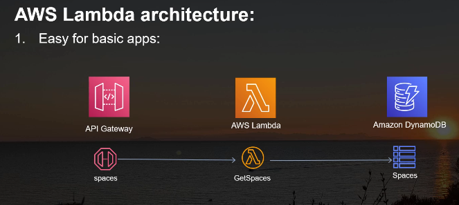
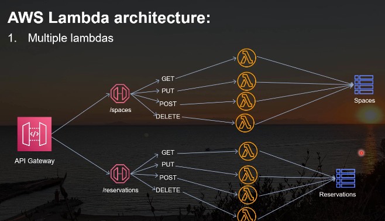
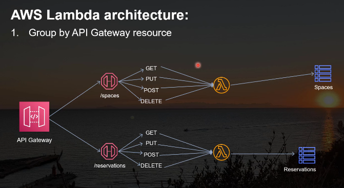
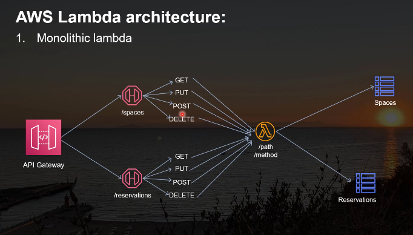
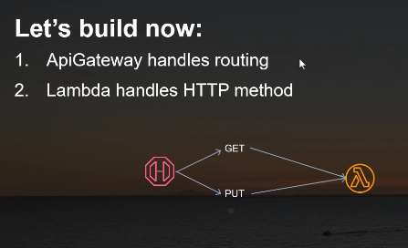

### Implementation of our lambda

the lambda defined in the hello.ts will serve the spaces table
create spaces folder which serves the spaces table inside services folder

# AWS DynamoDB with CDK and Lambda

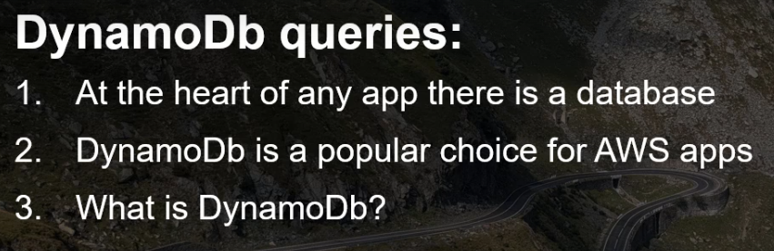
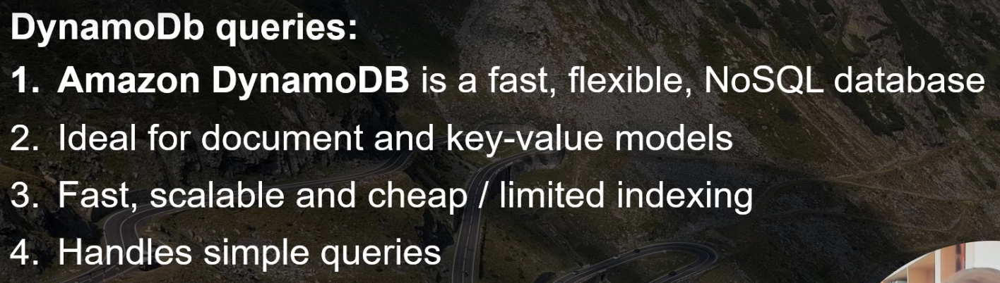
With DynamoDB we can write simple queries not complicated queries like SQL
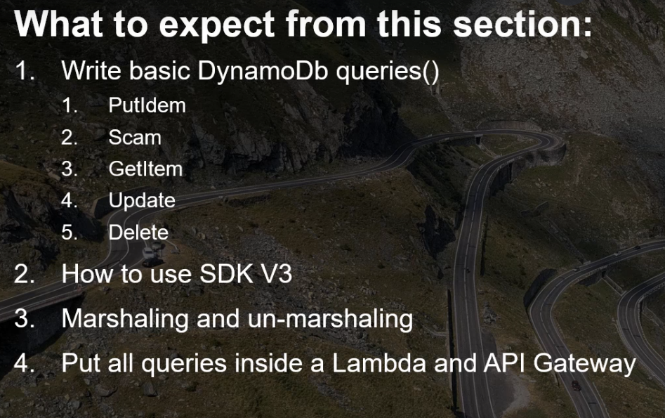

### Put Item

- In order for us to implement AWS dynamoDB we need to import it's SDK , we need to install it `npm i @aws-sdk/client-dynamodb`.
- When we are creating a entry into a DynamoDB , we need to pass it a ID , before even getting the data from our event, we should have a random ID.
- Also lambda needs to have permission to write to dynamoDB
- How we can get fast feedback from our implementation

### Scan operation

- when we do local testing GET scanCOmmand we get items from our table and that is a marshalled result { S: spaceId }

### GetItem Operation

### Marshalling

- when we retrive from our DB we get result wrapped inside an object which states their types id : { S: spaceId**\*\***\***\*\*** } which doesn't ook great
- when we put items into our DB we need to take each property of our item and specify it's type otherwose we will get error - cannot read properties of undefined when we make query with dynamoDB

```
Item: {
        id: { S: randomID },
        location: { S: item.location },
      },
```

- There are two solutions with this small problem - marshalling or unmarshalling
  - marshalling will add above kind of attribute type defintions to our object
  - unmarshalling will remove this attribute types right there
  - both of them part of `npm i @aws-sdk/util-dynamodb`
  - other is using DDBDocumentClient `npm i @aws-sdk/lib-dynamodb`

### Update Item

- request type PUT
- add queryParameter and content

### Data validation with Typescript

- Here firstly we have to think how we want our files to look like, because at some point this backend application will be linked to frontend and the way `they will communicate it will be by an interface`.SO the backend and frontend must come together and know what exact type of objects they will expect.
- create `Model` file - Think about how our reservation , our space entry will look like
- Let's create a function which will assert certain entries as space entry or not in `shared` Folder - what's contained in this folder will be shared with multiple lambdas

### DB queries deployment and test

### Bundle Optimization

Optimizations that you make will make your bundle smaller, your code faster & prevent lot of problems & esbuild will not make all the complicated ifs and checks from a UUID.It will just use this random crypto uuid from this native NodeJS module.

# Securing API's with AWS Cognito

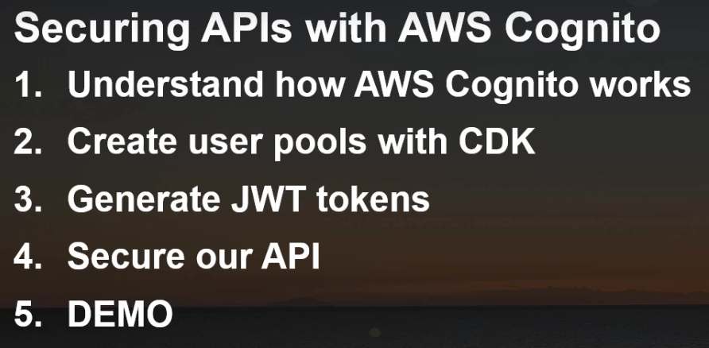

- AWS Cognito is combination of two important services - User Pools and Identity Pools
  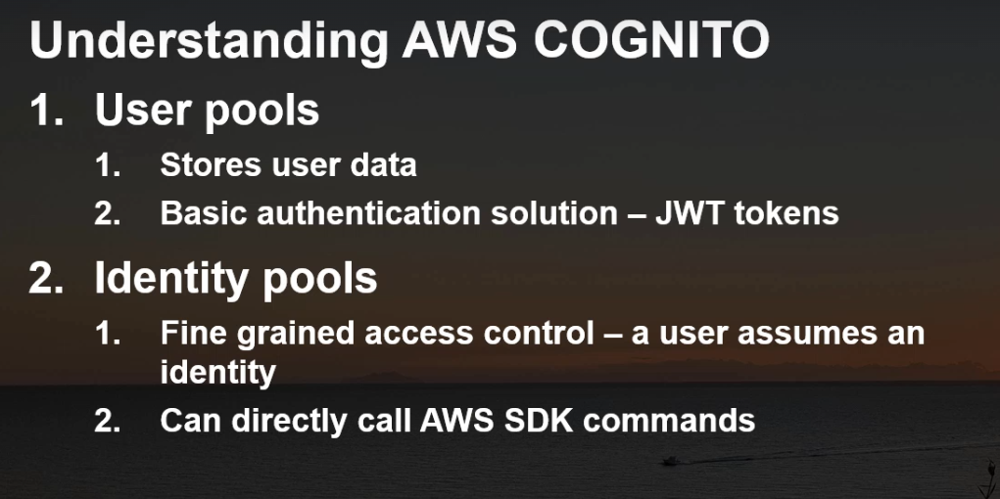
  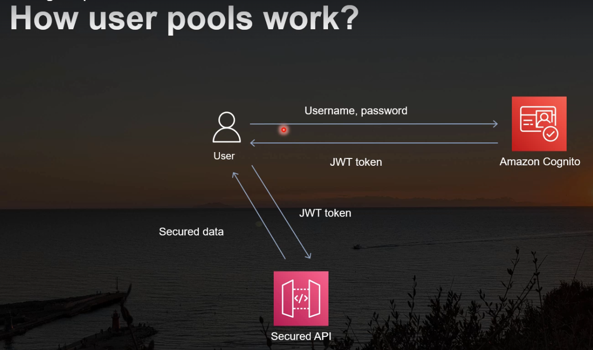
- Well, a user, let's say that he is registered to AWS Cognito and there he has a username and a password.
- A user first will log in to cognito and if these credentials are correct.
- AWS cognito will return back a JWT token, a JSON web token.
- Well, with this token, the user can simply now access a secure API or other component.
- with this JWT token, the user can access secured data.
- create a general userpool in AWS account - console

### user Pools with CDK

- this Auth stack will be a little more complex and will grow bigger throughout this course, We will organize things into private methods & call them inside the constructor.
- And this way we know exactly what is happening inside our class because we are using a programming language & let's take advantage of it.
- because we will need this user pool throughout this class and even outside this class & let's have a private user pool & client

```
  private userPool: UserPool;
  private userPoolClient: UserPoolClient;
```

### create and activate Cognito User

- create User - `console` - Force change password in users confirmation Status
- Activate User - `using CLI` - `aws cognito-idp admin-set-user-password --user-pool-id ap-south-1_***** --username abhimvp --password "********" --permanent` - refresh and we see it's confirmed in confirmation status
- install AWS Amplify and simulate APP

### Generate Tokens with AWS Amplify

- Now that we have an activated Cognito user, we can use it in order to generate tokens using Cognito
- reference code : [code](https://github.com/alexhddev/CDK-course-resources/commit/5de917afd440a8ac5b2c63f6c4fd3350b44d0764)
- we need two packages - we need the AWS Amplify package - `npm i aws-amplify` - we also need a AWS install AWS amplify Slash auth - `npm i @aws-amplify/auth`

### Understand how JWT Tokens Work

- https://jwt.io/ - This is a website which shows us the information about different tokens.

### Securing API's with Congito

- Let's now use the Cognito user pool that we created in the previous sections
- Let's use it to authorize or to secure to add security to our spaces API.
- Currently anyone if this API is deployed, anyone over the internet can access this API
- if we check any operation of this API(console), you will see that at the method request we have an entry called Authorization
- Well, at this point we can add an authorizer which can be either a Lambda authorizer or a Cognito user
- First of all, in order to be able to add this authorization to our API, we need to configure it from the Authorizers entry.
- at this point we can create a new authorizer using the AWS console.
- `since we are using CDK, let's do this inside CDK`
- what we want right here is to export or to make public our user pool because we need the a reference to this user pool inside our API to create a, uh, security layer.

### Access control with groups

- restrict access to login users
  - Basically, with the current implementation, all the users have the same rights
  - Well, we can change this by creating groups and then adding a user to a group.- `private createAdminsGroup`

# AWS Cognito Identity pools

- We have a user which is logged in into a web or mobile app, and he needs to send a file to a outside destination, like a drive, like a folder, like an S3 bucket, a file that can be anything, a profile photo , report or any general file.
- Well, how can we solve this issue? - One solution would be to build an API and to send that file in the body of the request - This solution would work, but would work only for smaller file files - And it is a little complicated because we need to encode and to decode that file - A better solution for this small problem, but very popular use case would be to directly call the SDK,the S3 SDK in the web app. - And in this section we will see how we can authorize those calls no matter the environment they are , It can be a web or mobile or even a desktop application.
  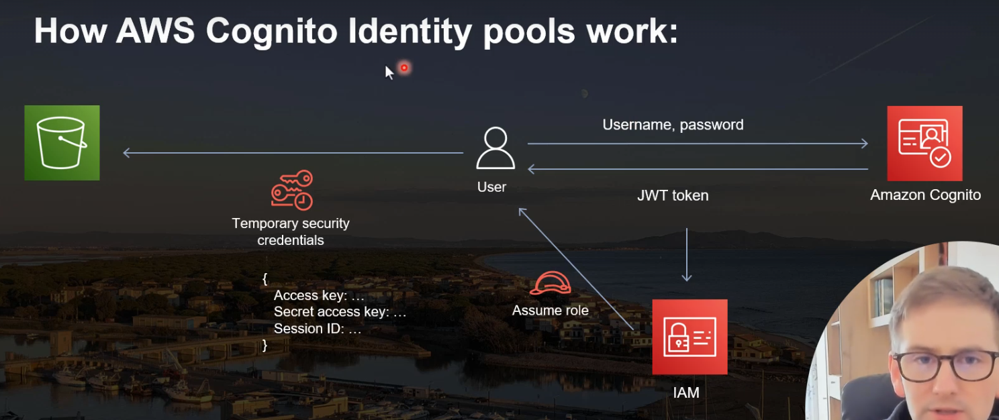
- we will create this cognito identity pools inside the AWS console.
- And then with CDK we will talk about roles and then we will generate these temporary credentials, we will test them locally, not inside the UI because at this point we don't have a UI,understand how we can use them and how we can test them Well enough talking.
- `The identity pools control what those users can do.` - Authenticated identity sources - Configure identity providers to be the source of your authenticated identities. Amazon Cognito issues temporary credentials in exchange for tokens or assertions from your providers.

### IAM Roles in CDK
- we will see how we can attach some roles to our new identity pools.

### Generating AWS Temporary credentials
- `npm i @aws-sdk/client-cognito-identity`
- `npm i @aws-sdk/credential-providers`

### Testing Temp AWS Credentials
